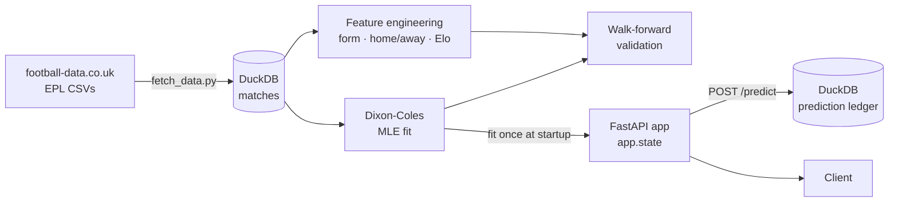

# Soccer Predictor 

A match-outcome prediction service for the English Premier League, built around a **Dixon-Coles** statistical model, validated with **walk-forward backtesting**, and served through a **FastAPI** app. Every prediction the API makes is written to a **tamper-evident, hash-chained ledger** in DuckDB, so the model's track record can't be quietly rewritten after the fact.

**Live API:** https://soccer-predictor-dy7l.onrender.com

> The premise of this project: a sports model is only credible if it is validated honestly and its predictions are auditable. The UI is secondary. The model, the validation, and the ledger are the product.

---

## Table of Contents

- [Highlights](#highlights)
- [Architecture](#architecture)
- [The Model](#the-model)
- [Validation Methodology](#validation-methodology)
- [Feature Engineering](#feature-engineering)
- [Prediction Ledger](#prediction-ledger)
- [API Reference](#api-reference)
- [Getting Started](#getting-started)
- [Testing](#testing)
- [Deployment](#deployment)
- [Design Decisions](#design-decisions)
- [Limitations](#limitations)
- [Roadmap](#roadmap)
- [Data Attribution](#data-attribution)

---

## Highlights

- **Dixon-Coles model** with attack/defense ratings, home advantage, exponential time-decay weighting, the low-score (rho) correction, and identifiability constraints so the optimizer converges to a stable solution.
- **Vectorized maximum-likelihood fit.** The negative log-likelihood is computed as batch NumPy operations instead of a per-row Python loop; a full 380-match season fits in roughly 0.07s. This matters because walk-forward validation refits the model at every rolling cutoff.
- **Walk-forward validation** that only ever predicts matches the model has not seen, reporting accuracy, log loss, Brier score, calibration, and per-class (home/draw/away) breakdowns.
- **Leakage-free feature engineering:** team form, home/away split form, and Elo ratings, each computed strictly from information available before kickoff.
- **Hash-chained prediction ledger** on DuckDB: each record's hash covers its own fields plus the previous record's hash, so any retroactive edit breaks the chain.
- **Fit once, serve many.** The model is fit at application startup via the FastAPI lifespan and cached in memory. No per-request refitting.
- **Tested** with pytest against synthetic data, so the suite doesn't depend on network downloads.

---

## Architecture



**Pipeline:** `DATA → MODEL → VALIDATE → FEATURES → PREDICT → API → LEDGER`

| Layer | Responsibility |
|---|---|
| Data ingestion | Downloads EPL results and loads them into DuckDB, the system of record for matches |
| Model | Dixon-Coles fit by maximum likelihood; produces expected goals and a scoreline probability grid |
| Validation | Rolling-origin backtest; produces comparable metrics across model versions |
| Features | Pre-kickoff team-form, home/away split form, and Elo features |
| API | FastAPI service exposing predictions and metadata |
| Ledger | Append-only, hash-chained record of every prediction served |

---

## The Model

The core model follows Dixon & Coles (1997), *Modelling Association Football Scores and Inefficiencies in the Football Betting Market*.

Each team `i` has an attack strength `α_i` and a defense weakness `β_i`, and the home side gets a shared home-advantage factor `γ`. Expected goals for a match with home team `i` and away team `j`:

```
λ (home goals) = α_i · β_j · γ
μ (away goals) = α_j · β_i
```

Goals are modeled as Poisson, with the Dixon-Coles correction `τ` applied to the four low-score cells (0-0, 1-0, 0-1, 1-1), where independent Poisson is known to be miscalibrated:

```
P(X = x, Y = y) = τ(x, y; λ, μ, ρ) · Pois(x; λ) · Pois(y; μ)
```

The 1X2 probabilities (home win / draw / away win) are obtained by summing the scoreline grid.

### What's implemented

| Component | Purpose |
|---|---|
| **Time-decay weighting** | Recent matches count more than old ones, since team strength drifts over a season. This is where most of the real predictive gain comes from. |
| **Low-score (rho) correction** | Adjusts probabilities for 0-0, 1-0, 0-1 and 1-1. A smaller effect on raw performance, but it makes the model statistically faithful. |
| **Identifiability constraints** | Mean-attack normalization so the optimizer converges to a stable, comparable solution rather than drifting along a flat direction of the likelihood. |
| **Vectorized likelihood** | Team lookups and goal arrays are built once outside the objective function; the math runs as batch array ops. |

---

## Validation Methodology

Random train/test splits leak the future into the past. Football results are a time series, so this project validates with **walk-forward (rolling-origin) backtesting**:

1. Fit the model on all matches before a cutoff date.
2. Predict the next unseen window of matches.
3. Record predictions alongside actual results.
4. Advance the cutoff and repeat.

### Metrics

| Metric | Why it's tracked |
|---|---|
| **Accuracy** | Easy to read, but insensitive to confidence, so it is never used alone |
| **Log loss** | Proper scoring rule; heavily penalizes confident wrong predictions |
| **Brier score** | Proper scoring rule; measures probability calibration error directly |
| **Calibration curve** | Shows whether "60%" predictions actually happen about 60% of the time |
| **Per-class breakdown** | Home/draw/away are reported separately. Draws are historically the hardest class to predict and deserve their own line |

Output is designed to be **comparable across model versions**, so a change (say, adding time-decay) has to earn its place with numbers.

### Reference points

| Predictor | Log loss | Brier (multiclass) |
|---|---|---|
| Uniform guess (⅓ / ⅓ / ⅓) | 1.0986 | 0.6667 |
| Dixon-Coles (walk-forward) | *add your measured value* | *add your measured value* |

A model that can't beat the uniform baseline on log loss isn't predicting anything. Beating it consistently on held-out, chronologically-later data is the bar.

---

## Feature Engineering

Feature engineering lives alongside the model and is built under one rule:

> **Every feature must use only information available before the match kicked off.**

Leakage is the most common way sports ML projects quietly become fake, so it is treated as a correctness requirement, not a nice-to-have.

| Feature group | Description |
|---|---|
| **Team form** | Rolling last-5 / last-10 match windows: goals scored, goals conceded, points |
| **Home/away split form** | Each home team's form computed from *only* its past home matches, and each away team's from *only* its past away matches. Some teams perform meaningfully better at home than their overall form suggests. |
| **Elo rating** | Sequential rating updated after each match. Inherently order-dependent, so it is harder to vectorize than the rest of the pipeline. |

---

## Prediction Ledger

The ledger is the project's differentiator. Every prediction the API serves is appended to a DuckDB table as one row:

| Column | Description |
|---|---|
| `prediction_id` | Unique ID returned to the caller |
| `match_id` | Match the prediction refers to |
| `home_team`, `away_team` | Teams |
| `model_version` | Which model produced the prediction |
| `predicted_at` | Timestamp of the prediction (stored as `VARCHAR`, see below) |
| `home_win_prob`, `draw_prob`, `away_win_prob` | Predicted 1X2 probabilities |
| `actual_result` | Nullable; filled in after the match is played |
| `record_hash` | Hash of all of the record's fields **plus the previous record's hash** |

### Why a hash chain

Because each `record_hash` depends on the previous record's hash, editing or deleting any historical row invalidates every hash after it. That makes the ledger tamper-evident: a verification function can walk the chain and confirm that no prediction was altered after being made. This is what turns "trust me, the model was right" into something checkable.

### Why `predicted_at` is a string

Timestamps round-trip through a database with subtle precision and formatting differences. Storing `predicted_at` as `VARCHAR` guarantees the exact bytes that were hashed are the exact bytes read back, so verification never fails on a formatting artifact.

---

## API Reference

Interactive docs are available at `/docs` (Swagger UI) and `/redoc` on any running instance.

### `GET /health`

Liveness check.

### `GET /teams`

Lists the teams the model was trained on. Use these exact names in `/predict`.

### `POST /predict`

Predicts a single match, writes the prediction to the ledger, and returns its `prediction_id`.

**Request**

```json
{
  "home_team": "Arsenal",
  "away_team": "Chelsea"
}
```

**Response** (shape shown for illustration)

```json
{
  "prediction_id": "…",
  "home_team": "Arsenal",
  "away_team": "Chelsea",
  "home_win_prob": 0.52,
  "draw_prob": 0.25,
  "away_win_prob": 0.23,
  "expected_home_goals": 1.68,
  "expected_away_goals": 1.02
}
```

**Errors**

| Status | Cause |
|---|---|
| `404` | Unknown team name (call `/teams` for valid names) |
| `400` | `home_team` and `away_team` are the same |

### Example

```bash
curl -X POST https://soccer-predictor-dy7l.onrender.com/predict \
  -H "Content-Type: application/json" \
  -d '{"home_team": "Arsenal", "away_team": "Chelsea"}'
```

---

## Getting Started

### Prerequisites

- Python 3.11+
- `pip` and `venv`

### Installation

```bash
git clone https://github.com/dgoumtsop/Soccer-Predictor.git
cd Soccer-Predictor/backend

python -m venv venv
source venv/bin/activate        # Windows: venv\Scripts\activate
pip install -r requirements.txt
```

### Load the data

Downloads EPL results from football-data.co.uk (2022/23 through the current 2026/27 season) into DuckDB:

```bash
python fetch_data.py
```

### Run the API

```bash
uvicorn main:app --reload
```

The model is fit once during startup, so the first boot takes a moment. Then open http://127.0.0.1:8000/docs.

---

## Testing

```bash
pytest
```

The API tests (`tests/test_main_api.py`) use **synthetic data**, so they run offline and deterministically. They cover:

- `/health` and `/teams`
- A successful `/predict` call
- Verification that the prediction was actually written to the ledger
- The `404` unknown-team and `400` same-team error cases

Model tests check that a fit produces valid probability outputs, and that the vectorized likelihood matches the behavior of the original implementation.

---

## Deployment

The backend is deployed on [Render](https://render.com) and **auto-redeploys on every push to `main`**.

Because the model is fit at startup and cached on `app.state`, a redeploy also picks up any newly ingested match data, so predictions reflect current-season form.

---

## Design Decisions

Settled decisions, recorded so they don't get relitigated:

| Decision | Rationale |
|---|---|
| **DuckDB as the system of record** | Matches and predictions live in one embedded analytical database instead of loose CSVs on disk. No server to run, fast columnar queries, easy to inspect. |
| **Fit once at startup** | Refitting per request would be wasteful and slow. The model is fit inside the FastAPI lifespan and cached on `app.state`. |
| **Hash-chained ledger** | Makes the prediction history tamper-evident, which is the core of the project's credibility. |
| **Validate before improving** | Walk-forward validation was built *before* the model upgrades, so every later change is measured against a baseline. |
| **Stacking, not replacement, for ML** | If a gradient-boosted model is added, Dixon-Coles' expected goals become an *input feature* to it, keeping the statistical model as the principled prior rather than throwing it away. |
| **Model earns its place** | A more complex layer only ships if it beats plain Dixon-Coles on held-out validation. |

---

## Limitations

Being upfront about what this is and isn't:

- **Data is results-only.** football-data.co.uk provides scores and basic match data. There is no expected-goals data, lineups, injuries, suspensions, or transfer information, all of which move real match probabilities.
- **Draws are hard.** Like every model in this space, predictions for draws are the weakest of the three classes.
- **One league.** The model is fit on the EPL only; promoted teams have little history and are estimated with more uncertainty.
- **Not betting advice.** This is an engineering and statistics project. It makes no claim to beat bookmaker closing lines.

---

## Roadmap

- [x] FastAPI skeleton and health check
- [x] EPL data ingestion
- [x] Dixon-Coles baseline with vectorized fit
- [x] Walk-forward validation
- [x] Hash-chained prediction ledger
- [x] Full Dixon-Coles (time-decay, rho correction, identifiability constraints)
- [x] Feature engineering (form, home/away split, Elo)
- [x] `/predict` and `/teams` endpoints with startup-cached model
- [x] Deployment to Render
- [ ] LightGBM stacking layer (deferred; must beat plain Dixon-Coles on held-out data)
- [ ] `POST /predict/batch`
- [ ] `GET /model/info` and `GET /model/performance`
- [ ] Ledger verification endpoint
- [ ] Frontend (React/Tailwind, single predict screen)
- [ ] CI/CD and monitoring

---

## Data Attribution

Match data is sourced from [football-data.co.uk](https://www.football-data.co.uk/). Please respect their terms of use if you reuse the data.

## References

- Dixon, M. J. & Coles, S. G. (1997). *Modelling Association Football Scores and Inefficiencies in the Football Betting Market.* Journal of the Royal Statistical Society: Series C, 46(2), 265–280.
